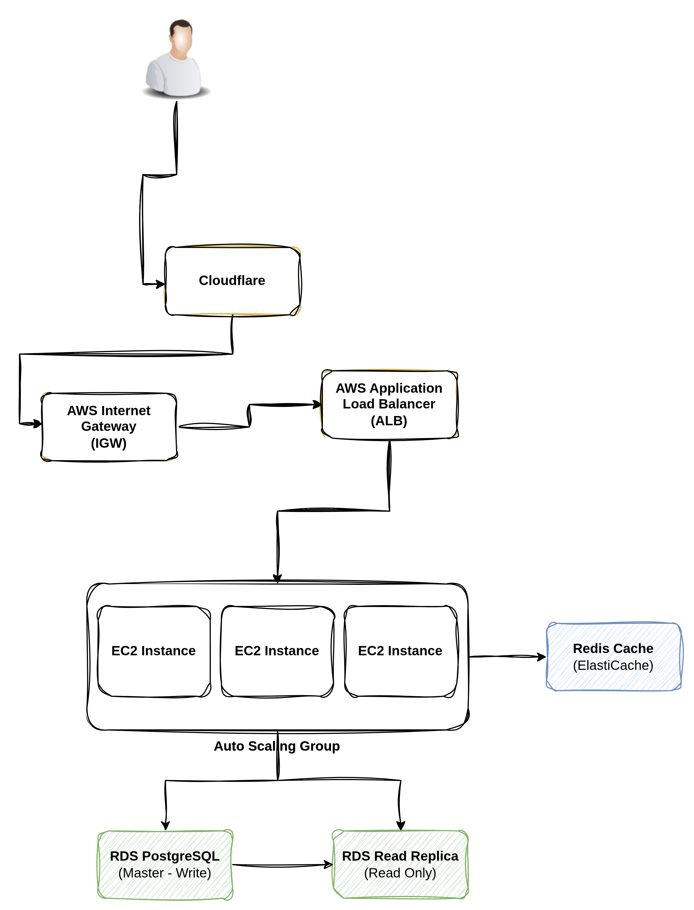
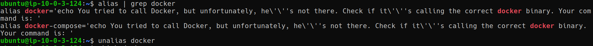
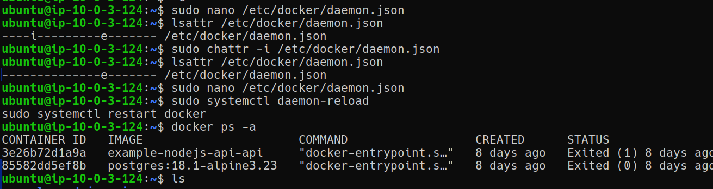
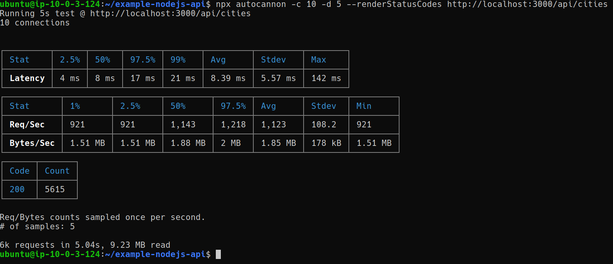

# Qiscus Technical Test of SRE

# Task 1: Deployment

### 1. List Tools
1. Docker & Docker Compose
2. Github actions
3. Grafana cloud 
4. Nginx
5. PostgreSQL
6. Docker Hub

## 2. Architecture Diagram
Berikut ini desain yang saya pilih untuk menangani 40k request per menit.

###### Penjelasan:
1. Redis Cache: Redis cache saya gunakan untuk mengurangi load pada database. Jadi query database akan disimpan sementara di Redis. Bertujuan untuk mengurangi load pada database dan mempercepat query.
2. RDS Read Replicas: Karena traffic didominasi olet GET, beban baca saya pisahkann ke beberapa read replicas. Database master menangani beban write agar tidak terjadi bottleneck.
3. Auto Scaling: Disini saya tambahkan auto scaling untuk menambahkan instance jika beban trafik meningkat dan mengurangi instance jika beban trafik menurun. Bertujuan untuk mengurangi biaya dan meningkatkan performa.

# Task 2:Root Cause Analysis

Summary: Ditemukan beberapa kesalahan mulai dari konfigurasi sistem operasi, konfigurasi docker daemon, hingga logic aplikasi. 

### A. Masalah yang ditemukan
1. Manipulasi alias docker yang menyebabkan docker tidak dapat dijalankan.

2. Docker gagal berjalan karena parameter userns-remap-to yang tidak valid pada file /etc/docker/daemon.json
3. File konfigurasi Docker dikunci dengan atribut immutable, mencegah perubahan meskipun menggunakan akses sudo.

4. Port 3000 sudah digunakan oleh nginx yang memblokir jalannya api.
5. Database Connection Leak: Aplikasi Node.js tidak melakukan client.release() setelah melakukan query, menyebabkan pool koneksi habis dengan cepat.
6. Improper Timeout Settings: Pengaturan connectionTimeoutMillis pada aplikasi terlalu rendah (100ms), menyebabkan error saat trafik tinggi.

### B. Metode Identifikasi
1. Analisis log sistem menggunakan journalctl -u docker.service untuk mendiagnosa kegagalan daemon.
2. Menggunakan lsattr untuk mendeteksi adanya atribut immutable pada file konfigurasi.
3. Menggunakan lsof -i :3000 untuk menemukan proses Nginx yang membajak port aplikasi.
4. Analisis docker logs secara real-time untuk mendeteksi error ECONNREFUSED, undefined_table, dan timeout exceeded.
5. enggunakan autocannon untuk mereplikasi kegagalan di bawah beban trafik tinggi.

### C. Langkah Perbaikan
1. Mengembalikan alias docker ke state semula.
2. Menghapus parameter userns-remap-to yang tidak valid pada file /etc/docker/daemon.json.
3. Menghapus atribut immutable dari file konfigurasi Docker.
4. Menghentikan dan menonaktifkan service Nginx yang memblokir port 3000.
5. **Patching Aplikasi:**  
    a. Mengubah DB_HOST dari localhost ke db agar sesuai dengan network Docker.
    b. Menambahkan client.release() pada blok finally di app.js.
    c. Menaikkan connectionTimeoutMillis menjadi 2000ms untuk stabilitas.
6. Menggunakan volume mounting pada /docker-entrypoint-initdb.d/ untuk memastikan skema SQL terimport otomatis saat container dijalankan.
7. Menambahkan cron job untuk membersihkan build cache dan image yang tidak terpakai setiap jam.

### D. Verifikasi
Setelah perbaikan, dilakukan uji beban menggunakan autocannon dengan hasil sebagai berikut: 
1. Total Requests: ~6000 requests dalam 5 detik.
2. Status Codes: 100% Success (200 OK).
3. Error Rate: 0% Non-2xx responses.

